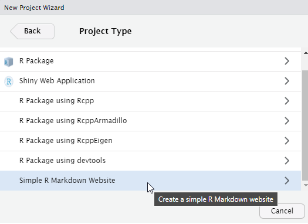
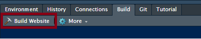
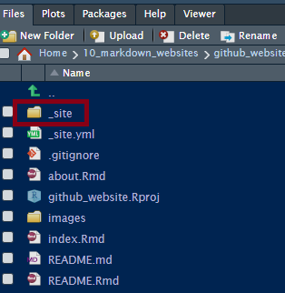

README
================

## Introduction

This website project demonstrates the workflow for building a simple
website for deployment on GitHub as part of **GitHub Pages**.

## Workflow

First off, the website project you are looking at has been created from
an R Project. Select *File &gt; New Project &gt; Simple R Markdown
website*.

 Build the site at
once leaving any generated files as-is during the project creation
process.

This all should run smoothly. Verify that the Build Website process has
created the \_*site* folder:

From the Terminal window, navigate to the \_*site* folder and perform a
*git init*.
